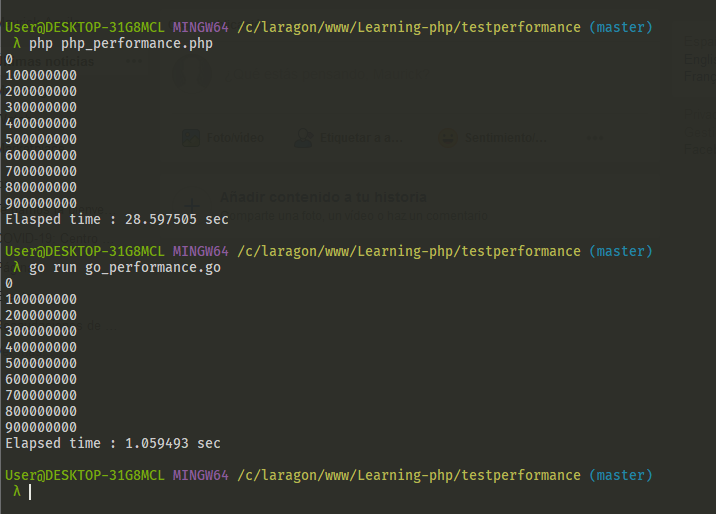

# Learning-php

> *No me gusta PHP*


## Temas

- [Instalación y Configuración](./001/README.md)
- [Variables,operadores y datos](./002/)
- [Arreglos y manejo de errores](./003/)
- [Estructuras de control y funciones](./004/)
- [Introduccion a POO en PHP](./005/)
- [POO avanzado I](./006/)
- [POO avanzado II](./007/)

## Conclusión

```php
    <?php
        $first_time = microtime(true);
        for ($i=0; $i < 1000000000 ; $i++) { 
            if($i % 100000000 === 0)
                echo "{$i}\n";
        }
        $last_time = round(microtime(true) - $first_time,6);
        echo "Elasped time : {$last_time} sec\n";
    ?>
```

```go
    package main

    import (
        "fmt"
        "time"
    )

    func main() {
        firstTime := float64(time.Now().UnixNano())

        for i := 0; i < 1000000000; i++ {
            if i%100000000 == 0 {
                fmt.Println(i)
            }
        }
        lastTime := float64(time.Now().UnixNano())
        fmt.Printf("Elapsed time : %f sec\n", (lastTime-firstTime)/1000000000)
    }
```

> **Pruebas**



## Referencias

- https://www.youtube.com/watch?v=cr92SsKX9M4
- https://www.youtube.com/watch?v=taF20kg-OG0
- https://www.php.net/manual/es/language.oop5.paamayim-nekudotayim.php
